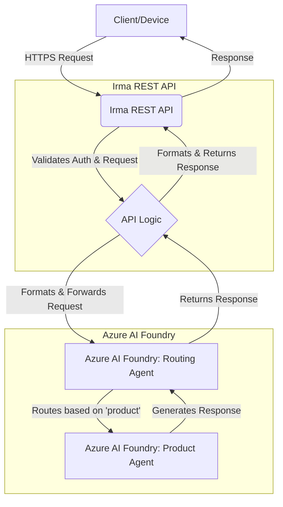

# Irma REST API and Azure AI Foundry Interaction

This document outlines the architecture and implementation strategy for integrating the Irma REST API with the agent-based system hosted in Azure AI Foundry. It details the data flow, state management, and security considerations for building a robust and scalable conversational AI platform.

---

## Table of Contents

1. [Overall Interaction Architecture](#1-overall-interaction-architecture)
2. [Endpoint Implementation Details](#2-endpoint-implementation-details)
3. [Threading, State Management, and Security](#3-threading-state-management-and-security)
4. [Example Chat Workflow](#4-example-chat-workflow)

---

## 1. Overall Interaction Architecture

The system is composed of two primary components:

- **Irma REST API**: A .NET 9/10 application that serves as the public-facing entry point for all clients. It handles authentication, request validation, conversation management, and state persistence.
- **Azure AI Foundry**: Hosts the conversational AI logic, which is implemented as a system of interconnected agents. This includes a primary "Routing Agent" and multiple specialized "Product Agents."

### High-Level Data Flow

The interaction follows a clear, decoupled pattern:



1.  **Client to API**: A client (e.g., a device's companion app) sends an HTTPS request to the Irma REST API. The request includes a JWT bearer token for authentication.
2.  **API Layer**: The .NET API validates the JWT, ensuring the user is authenticated and has the required scopes (`chat.read`, `chat.write`). It also validates the request payload against the OpenAPI specification.
3.  **API to AI Foundry**: The API layer translates the incoming request into a call to the Azure AI Foundry's **Routing Agent**. It passes the user's message along with critical metadata, including the `product` identifier and a unique `threadId` corresponding to the `conversationId`.
4.  **AI Foundry Internal Routing**: The **Routing Agent** inspects the `product` metadata (e.g., "Ixx/1.0"). Based on this information, it determines which specialized **Product Agent** is best equipped to handle the query and forwards the request to it.
5.  **Response Generation**: The selected **Product Agent** processes the query, leveraging its specialized knowledge base and tools to generate a response.
6.  **Response Return**: The response is passed back through the Routing Agent to the API layer. For streaming endpoints, this happens in chunks.
7.  **API to Client**: The API layer formats the response according to the API specification (either a complete JSON object or a Server-Sent Events stream) and sends it back to the client.

---

## 2. Endpoint Implementation Details

This section describes the high-level logic for each REST API endpoint.

### `POST /conversations`

This endpoint initiates a new chat session.

1.  **Authentication/Authorization**: Validate the incoming JWT bearer token. The token must be valid and contain the `api://irma/chat.write` scope.
2.  **Create Conversation State**:
    - Generate a new, unique `conversationId` (UUID).
    - Create a new "thread" in the Azure AI Foundry. The `threadId` returned from the Foundry should be stored.
    - Persist the mapping between the `conversationId`, the AI Foundry `threadId`, and the user's identity (e.g., the `sub` or `oid` claim from the JWT). This is crucial for security and state management. A simple database table like `Conversations` would be suitable:
      | `ConversationId` (PK) | `FoundryThreadId` | `UserId` | `CreatedDateTime` |
      |-----------------------|-------------------|----------|-------------------|
      | `uuid`                | `string`          | `string` | `datetime`        |
3.  **Response**: Return a `201 Created` response with the newly created `Conversation` object, including the `conversationId`.

### `POST /conversations/{conversationId}/chat` (Synchronous)

This endpoint sends a message in an existing conversation.

1.  **Authentication/Authorization**: Validate the JWT and required `api://irma/chat.write` scope.
2.  **State Retrieval and Validation**:
    - Retrieve the conversation record from the database using the `conversationId` from the URL path.
    - **Security Check**: Verify that the `UserId` stored with the conversation matches the user identity from the current JWT. If they do not match, return a `404 Not Found` or `403 Forbidden` to prevent one user from accessing another's conversation.
    - Retrieve the corresponding `FoundryThreadId`.
3.  **Call AI Foundry**:
    - Construct a request to the **Routing Agent** in Azure AI Foundry.
    - The request should include:
        - `FoundryThreadId`: To maintain context within the AI Foundry.
        - `message`: The user's message from the request body.
        - `additionalContext`: Any additional context provided.
        - `metadata`: A structured object containing the `product` identifier (e.g., `{ "product": "Ixx/1.0" }`).
4.  **Response Handling**:
    - Await the complete response from the AI Foundry.
    - The API is responsible for updating its own state, such as `turnCount`.
    - Format the response into the `ConversationWithMessages` schema, including the full message history as required by the spec.
    - Return a `200 OK` with the JSON payload.

### `POST /conversations/{conversationId}/chatOverStream` (Streaming)

This endpoint sends a message and streams the response.

1.  **Authentication and Validation**: Same as the synchronous endpoint, including the critical security check to match the `UserId`.
2.  **Establish SSE Connection**: Set the response `Content-Type` to `text/event-stream`.
3.  **Call AI Foundry (Streaming)**:
    - Make a streaming call to the **Routing Agent**. The logic is similar to the synchronous call, but the API will now receive chunks of data instead of a single response.
4.  **Stream Processing**:
    - As data chunks are received from the AI Foundry, the API layer must:
        - Wrap each chunk in the Server-Sent Events (SSE) `data:` format.
        - Forward events like `keepalive` directly to the client.
        - If the Foundry signals the end of the stream, the API sends the `event: end` message.
        - If an error occurs mid-stream, the API sends an `event: error` and closes the connection.
    - The API acts as a pass-through proxy for the stream, adding the necessary SSE framing.

---

## 3. Threading, State Management, and Security

### Mapping Conversations to AI Foundry Threads

The core of maintaining conversational context lies in correctly mapping the API's `conversationId` to a "thread" or equivalent concept in Azure AI Foundry.

-   **1:1 Mapping**: Each `conversationId` in the Irma API MUST correspond to exactly one `threadId` in the AI Foundry.
-   **State Management at the API Layer**: The API layer is responsible for managing this mapping. A persistent store (e.g., Azure SQL, Cosmos DB) is required to store the relationship between `conversationId`, `FoundryThreadId`, and `UserId`. This externalizes the state from the .NET application, allowing it to be stateless and scalable.

The API does **not** need to store the message history itself, as the AI Foundry thread is assumed to manage the full context of the conversation. The API only needs to store the mapping.

### Security: Preventing Conversation Hijacking

The most significant security risk is an attacker using a known `conversationId` to access or interfere with another user's session. The solution is to bind each conversation to the authenticated user.

**Implementation:**

1.  **On Conversation Creation (`POST /conversations`)**: When a conversation is created, extract a stable user identifier from the JWT (e.g., `sub` for subject or `oid` for object ID). Store this `UserId` alongside the `conversationId` and `FoundryThreadId`.
2.  **On Every Subsequent Request (`POST .../chat`)**:
    - For every request to an existing conversation, extract the `UserId` from the token.
    - Before processing the request, query the database for the given `conversationId`.
    - **Crucially, compare the `UserId` from the token with the `UserId` stored in the database for that conversation.**
    - If they do not match, the request is unauthorized. Return an `HTTP 404 Not Found`. We use 404 instead of 403 to avoid revealing that the conversation ID is valid but belongs to someone else.

This ensures that even if a `conversationId` is leaked, it is useless without a valid JWT for the user who created it.

### Handling De-synchronized State (Lost Foundry Thread)

A critical edge case is when the AI Foundry thread is deleted or lost, but the conversation record still exists in the Irma API's database. This could happen if the Foundry's state is reset or a thread expires.

If a user attempts to send a message to a `conversationId` whose underlying `FoundryThreadId` is no longer valid in the Foundry, the API should **not** transparently create a new thread. Doing so would lead to a broken user experience due to the complete loss of conversational context.

**Recommended Implementation:**

1.  The API calls the AI Foundry with the stored `FoundryThreadId`.
2.  The AI Foundry returns an error indicating the thread was not found.
3.  The Irma API should then return an `HTTP 409 Conflict` error to the client.
4.  The error response body should clearly state that the conversation has expired and a new one must be created.

```json
{
  "code": "Conflict",
  "message": "The conversation context has expired or been lost. Please start a new conversation.",
  "target": "conversationId",
  "traceId": "..."
}
```

This approach forces the client to handle the error and guide the user to start a new conversation by calling `POST /conversations`, which is the correct and most transparent way to manage the loss of state.

---

## 4. Example Chat Workflow

This workflow demonstrates a complete interaction, from creating a conversation to sending a message.

**Actors:**
- **Device App**: The client application.
- **Irma API**: The .NET REST API.
- **AI Foundry**: The agent system.

---

**Step 1: Device App Initiates a New Conversation**

The user opens their device app and wants to start a chat.

1.  **Device App -> Irma API**: The app sends a request to create a conversation.
    ```http
    POST /v1/irma/conversations HTTP/1.1
    Host: api.irma.example.com
    Authorization: Bearer {jwt_for_user_A}
    Content-Type: application/json

    {}
    ```
2.  **Irma API (Internal Logic)**:
    - Validates the JWT for User A.
    - Calls the AI Foundry to create a new thread, receiving `foundry-thread-123` back.
    - Generates a new `conversationId`: `conv-abc-456`.
    - Stores the mapping in its database: `(conv-abc-456, foundry-thread-123, user_A_id)`.
3.  **Irma API -> Device App**: The API returns the new conversation details.
    ```http
    HTTP/1.1 201 Created
    Content-Type: application/json

    {
      "id": "conv-abc-456",
      "createdDateTime": "2025-10-29T10:00:00.000Z",
      "state": "active",
      "turnCount": 0
    }
    ```

---

**Step 2: User Sends a Message**

The user asks a question about their "Ixx/1.0" camera.

1.  **Device App -> Irma API**: The app sends the message to the chat endpoint using the `conversationId`.
    ```http
    POST /v1/irma/conversations/conv-abc-456/chat HTTP/1.1
    Host: api.irma.example.com
    Authorization: Bearer {jwt_for_user_A}
    Content-Type: application/json

    {
      "message": "Is the temperature reading normal?",
      "additionalContext": [
        { "text": "Current temperature: 42°C" }
      ],
      "product": "Ixx/1.0"
    }
    ```
2.  **Irma API (Internal Logic)**:
    - Validates the JWT for User A.
    - Looks up `conv-abc-456` in its database. It finds the record and confirms the owner is `user_A_id`, which matches the token.
    - It retrieves the `FoundryThreadId`: `foundry-thread-123`.
    - It calls the AI Foundry's Routing Agent, passing the thread ID, message, context, and product metadata.
3.  **AI Foundry (Internal Logic)**:
    - The Routing Agent receives the request for `foundry-thread-123`.
    - It inspects the metadata and sees `"product": "Ixx/1.0"`.
    - It routes the request to the **Ixx Product Agent**.
    - The Ixx agent processes the question ("Is 42°C normal?") and generates a response.
4.  **AI Foundry -> Irma API**: The Foundry returns the complete response text: "A temperature of 42°C is above the normal operating range of 20-35°C. You should check the device for proper ventilation."
5.  **Irma API -> Device App**: The API formats the final response and sends it back.
    ```http
    HTTP/1.1 200 OK
    Content-Type: application/json

    {
      "id": "conv-abc-456",
      "turnCount": 1,
      "messages": [
        { "id": "msg-1", "text": "Is the temperature reading normal?", ... },
        { "id": "msg-2", "text": "A temperature of 42°C is above the normal operating range...", ... }
      ],
      ...
    }
    ```

---

**Step 3: Conversation Ends**

The user closes the chat window.

-   **No Explicit End**: The conversation is implicitly "over." There is no `DELETE` or `END` endpoint.
-   **State**: The conversation `conv-abc-456` remains `active` in the database. If the user returns later, they can continue the conversation, and the context will be preserved in the AI Foundry via `foundry-thread-123`.
-   **Cleanup (Optional)**: A background job could be implemented to archive or delete conversations that have been inactive for an extended period (e.g., > 30 days) to manage resources in both the API database and the AI Foundry.
